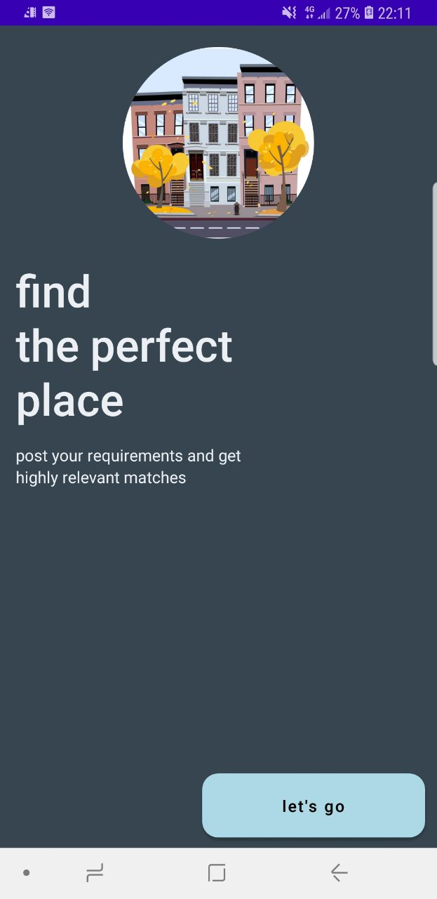
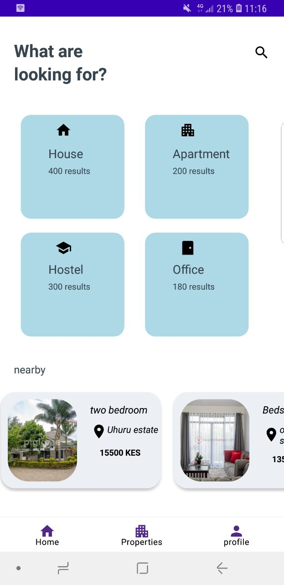
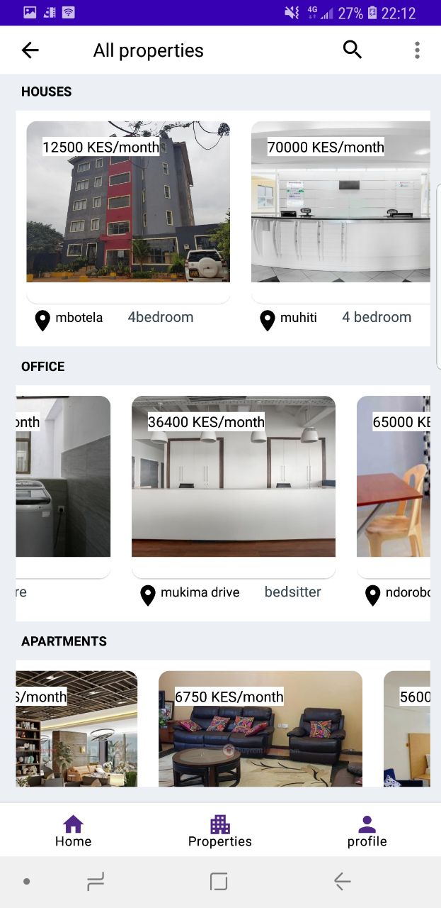
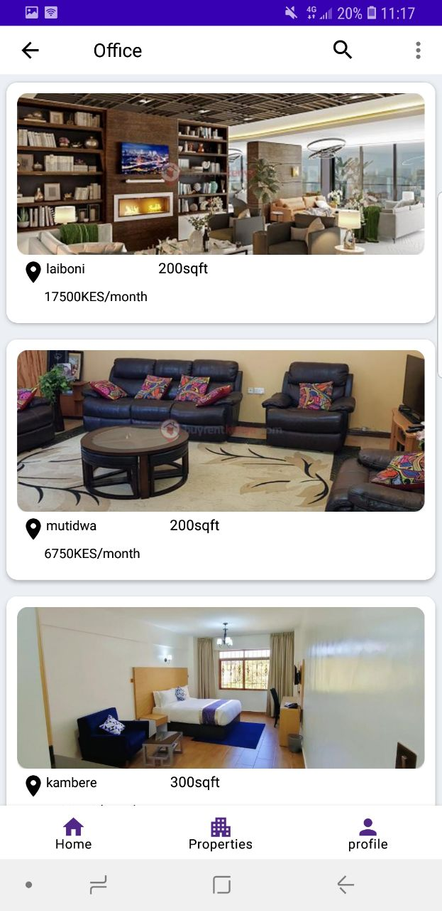
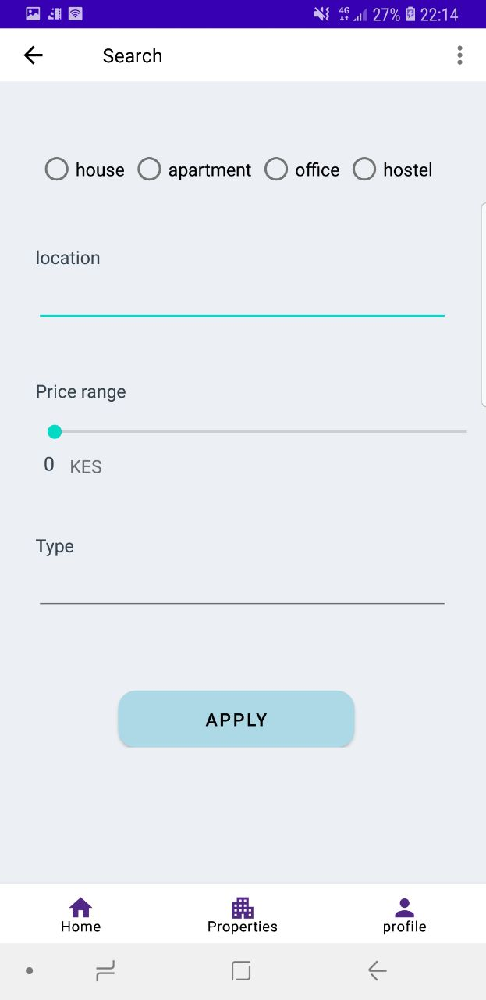
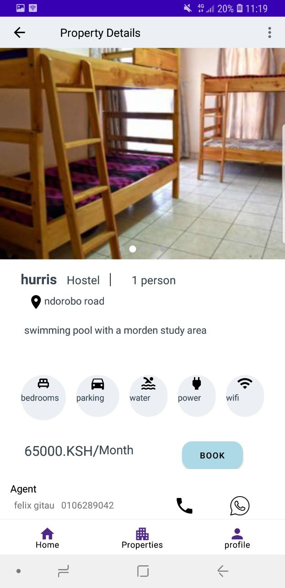
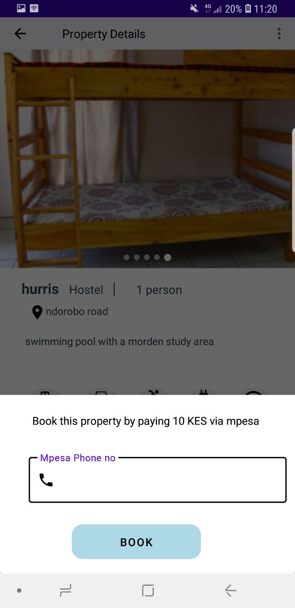
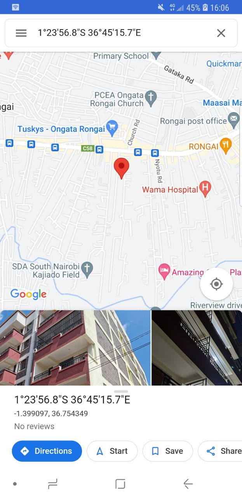

# Heroic properties

- A property finder app for Android that list properties such as houses, apartments, hostels and office space for rent . 
- The app allows users to input their preferences and location, and the app returns a list of properties 
that match the criteria. 
- The app also includes features such as property details, photos, and contact information for the
property owner or real estate agent. 
- The user can also save their favorite properties and receive notifications when similar properties become available.

## Features

- User authentication and authorization using Laravel.
- Property listing, browsing, and search functionality.
- Shopping cart and order management.
- Secure payment processing using mpesa.
- Contact Agent: Enables users to directly contact the property owner or real estate agent through the app
- Push Notifications: Notifies users of new or updated properties that match their search criteria
- Interactive Map View: Allows users to view properties on a map and see nearby amenities, public transportation, and more
- Reviews and Ratings: Allows users to rate and review properties and agents, providing valuable feedback for other users
- Offline Access: Lets users access property information and saved searches even when they do not have an internet connection

## screens

<table>
	  <tr>
		 <td>Welcome screen</td>
		  <td>Home</td>
		  <td>All properties</td>
	  </tr>
	  <tr>
		 <td></td>
		 <td></td>
		 <td></td>
	  </tr>
	  <tr>
		 <td>property category items</td>
		  <td>Search</td>
		  <td>more details</td>
	  </tr>
	  <tr>
		 <td></td>
		 <td></td>
		 <td></td>
	  </tr>
  <tr>
		 <td>Booking property</td>
		  <td>map view</td>
	  </tr>
	  <tr>
		 <td></td>
		 <td></td>
	  </tr>
	 </table>

## Requirements

- Android Studio
- PHP 7+ and composer for Laravel

## installation

- Clone the repository.
- Set up the Laravel backend by following the instructions in the backend directory.
- Open the Android project in Android Studio and build the app.

## usage

- Run the Laravel backend server.
- Install the app on an Android device or emulator.
- Log in or create an account to start browsing and buying products.

## contributions
Contributions are welcome. Please create a pull request for any changes or improvements.

## license

This project is licensed under the MIT license.

